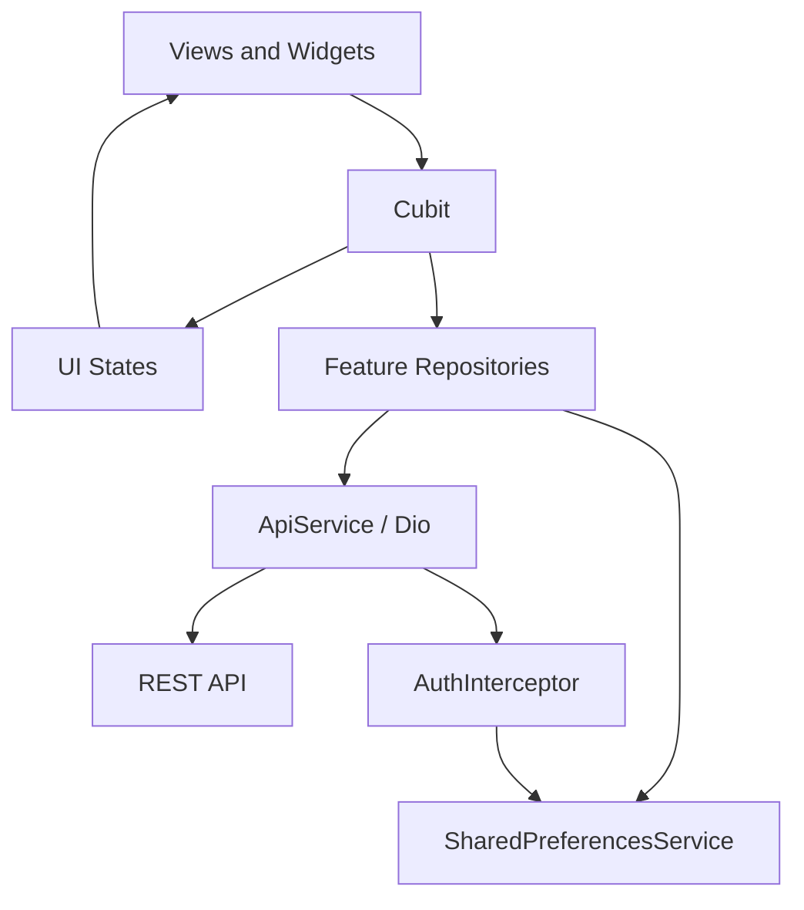

<p align="center">
  
</p>

<h1 align="center">🛒 Marketi — E-Commerce App</h1>

<p align="center">
  A Flutter training project at CS Academy.
</p>

<p align="center">
  
  
  
  
</p>

<p align="center">
  <a href="#about">About</a> ·
  <a href="#features">Features</a> ·
  <a href="#learning">Learning Experience</a> ·
  <a href="#artwork">App Artwork</a> ·
  <a href="#architecture">Architecture</a> ·
  <a href="#tech-stack">Tech Stack</a> ·
  <a href="#getting-started">Getting Started</a>
</p>

---

<a id="about"></a>

## 🛍️ About the App

**Marketi** is an e-commerce application developed as part of the **Flutter training program at CS Academy**. The project puts the concepts practiced during training into an application, from building interfaces and managing state to connecting screens to a REST API.

The shopping experience includes onboarding, account registration, product browsing and search, favorites, a cart, and profile editing, with a light theme and Poppins typography.

This repository contains the **final version of the training project**, documenting the features and Flutter skills applied throughout the program.

<a id="features"></a>

## ✨ Key Features

- 🚀 **Splash & Onboarding** — A branded splash screen and three introduction pages.
- 🔐 **Authentication** — Email sign-up and login, form validation, and a saved session.
- 🔑 **Password Recovery** — Email verification codes and password reset.
- 🏠 **Product Browsing** — Products, categories, and brands, with pagination and category or brand filters for loaded products.
- 🔍 **Search** — Product search through the API with debounced input and paginated results.
- 📦 **Product Details** — Image galleries, prices, discounts, ratings, customer reviews, and product information.
- ❤️ **Favorites** — Add, remove, and browse favorite products.
- 🛒 **Shopping Cart** — Add products and view cart items and their subtotal.
- 👤 **Profile** — View and edit personal information, with updates saved locally after a successful API request.

<a id="learning"></a>

## 📚 Learning Experience

The project provided practical experience with:

- Building Flutter screens using reusable widgets, shared themes, and custom fonts.
- Managing UI state with **Cubit**, `BlocBuilder`, and `BlocListener`.
- Connecting to REST endpoints using **Dio** and handling authentication headers.
- Converting JSON responses into Dart models and organizing data access through repositories.
- Saving session data, onboarding progress, and profile information with **SharedPreferences**.
- Implementing navigation, form validation, pagination, and loading, empty, and error states.
- Organizing the code by feature to keep related screens, state logic, and data operations together.

<a id="artwork"></a>

## 🎨 App Artwork

Illustrations used in Marketi's three onboarding pages:

<table>
  <tr>
    <td align="center" width="33%">
      
    </td>
    <td align="center" width="33%">
      
    </td>
    <td align="center" width="33%">
      
    </td>
  </tr>
  <tr>
    <td align="center"><b>Welcome to Marketi</b></td>
    <td align="center"><b>Easy to Buy</b></td>
    <td align="center"><b>Wonderful User Experience</b></td>
  </tr>
</table>

<a id="architecture"></a>

## 🏛️ App Architecture

The codebase follows a **feature-based structure**. Each feature separates its data access from its presentation code, while `core` provides shared services, routing, themes, and widgets.



### Project Structure

```text
lib/
├── main.dart                  # Application entry point
├── e_commerce_app.dart         # App configuration
├── core/
│   ├── common/                # Shared widgets and utilities
│   ├── constants/             # API endpoints, assets, and preference keys
│   ├── extensions/            # Screen and snackbar helpers
│   ├── routing/               # Navigation
│   ├── services/              # Networking, local storage, and error handling
│   └── themes/                # Colors and typography
└── features/
    ├── auth/
    ├── cart/
    ├── favorit/
    ├── home/
    ├── onboarding/
    ├── product_details/
    ├── profile/
    └── search/
```

Feature code is grouped into `data` and `presentation` folders. Images and fonts are stored in `assets/`.

<a id="tech-stack"></a>

## 🛠️ Tech Stack

| Purpose | Technology |
| :--- | :--- |
| UI & Language | Flutter, Dart |
| State Management | Cubit / flutter_bloc |
| API Integration | Dio |
| Local Storage | shared_preferences |
| Navigation | Flutter Navigator |
| Styling | Material widgets, Poppins |
| Native Splash | flutter_native_splash |

Package versions are listed in [pubspec.yaml](pubspec.yaml).

<a id="getting-started"></a>

## 🚀 Getting Started

### Prerequisites

- Flutter with Dart `>=3.10.4 <4.0.0`.
- Git and an editor such as VS Code or Android Studio.
- An Android emulator or connected device. For iOS, use macOS and Xcode.
- An internet connection for dependencies and API requests.

### Run Locally

```bash
git clone https://github.com/ReemMohsn/e_commerce.git
cd e_commerce
flutter pub get
flutter run
```

Use `flutter doctor` to check your setup and `flutter devices` to list available devices.

The API address is already configured in [api_end_points.dart](lib/core/constants/api_end_points.dart). The app connects to a hosted backend, so API features require the service to be available.

On first launch, complete onboarding, then create an account or sign in to explore the app.

## 👩‍💻 Author

[ReemMohsn](https://github.com/ReemMohsn)

Built during the Flutter training program at **CS Academy**.
